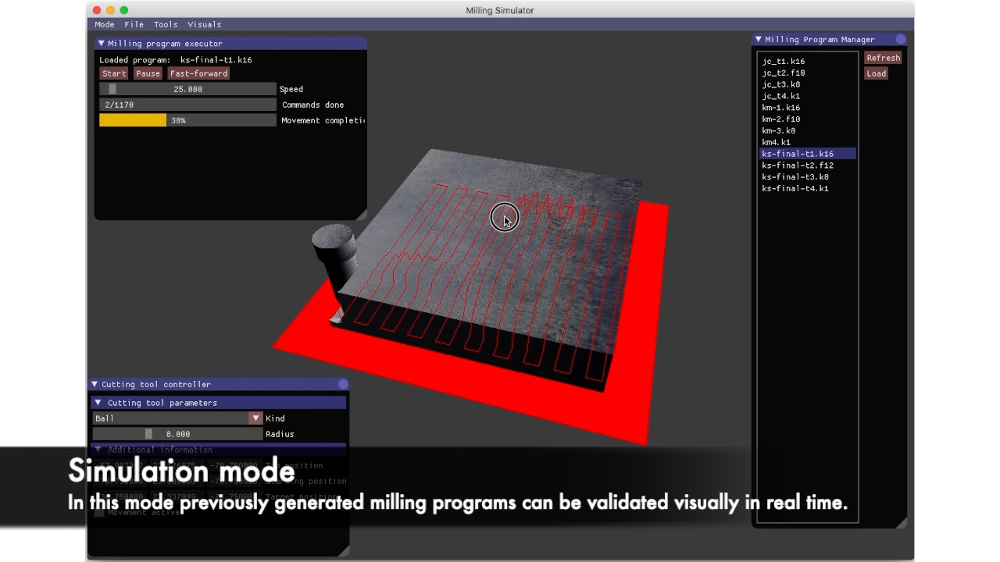
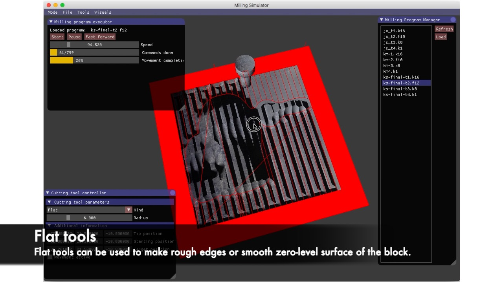
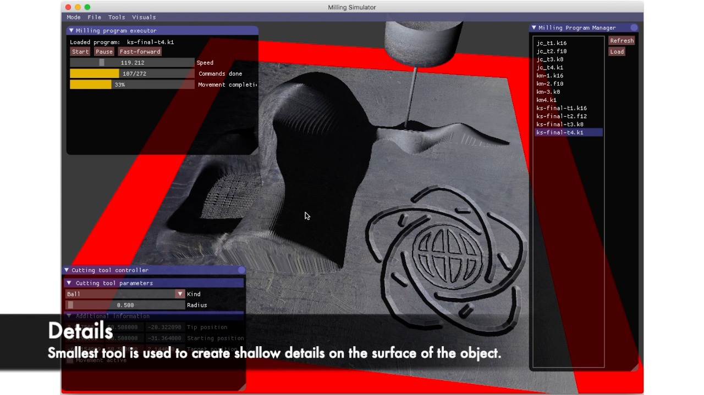
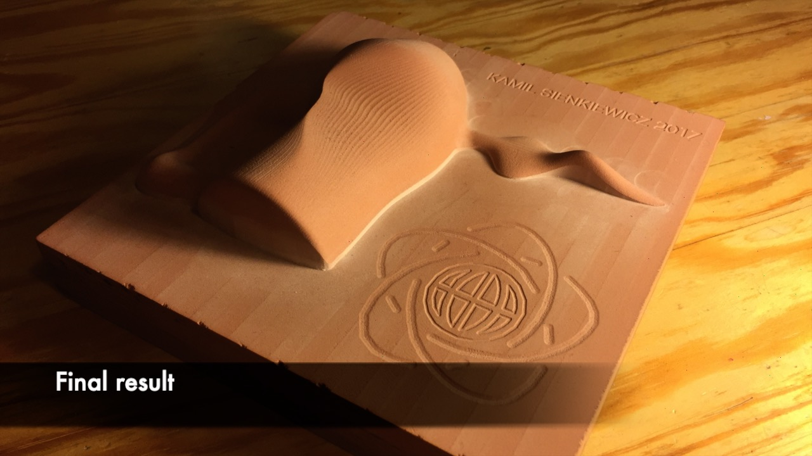

# 3C Milling Simulator

Milling simulator for 3C machines. Implemented as a main project during university course.

Contains two modules: 

* milling simulator for 3C machines in C++ for testing simplified G-code with live preview.
  Simulator has a built-in safety checks for tool breaking operations like drilling with flat
  cutting tool or reaching too deep into the material.
* generator of instructions for 3C machine to produce paths to create
  previously designed model in my own software. Generated instruction set was later
  executed on real machine and produced a high quality physical model.

## Preview

A live animation can be found on [YouTube](https://youtu.be/WLJPnmCVyE4).

